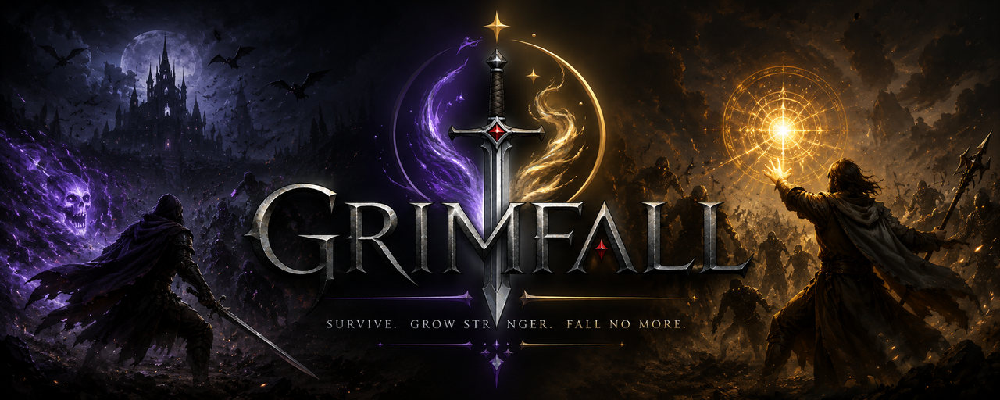

<p align="center">
  
</p>

<p align="center">
  <strong>A game by Alperen Karabıyık</strong>
</p>

<p align="center">
  
  
  
</p>

---

# Grimfall

A browser roguelite in the *survivors* tradition: you never press attack. You move,
your weapons fire themselves, and the only question is whether your build outgrows
the horde before it closes over you. Survive twenty minutes, bring down Parduin the
Drake God, and carry your gold into the next run.

Plays in any modern browser, on desktop, phone or tablet. Nothing to install.

---

## Run it

```bash
npm run dev            # then open http://localhost:5173
npm run preview        # serve dist/ instead, exactly as it will ship
PORT=5174 npm run dev  # if something already has 5173
```

Any static file server works — `npx serve`, `python -m http.server`, nginx, whatever
you already have. ES modules need a real HTTP origin, so opening `index.html`
straight off the disk will not work.

## Deploy it

```bash
npm run build          # -> dist/
npm run build:zip      # -> dist/ and grimfall-web.zip, ready for itch.io
```

`dist/` is the game and nothing else: no tests, no dev server, no build tools,
no `package.json`. On top of copying, the build

- injects a **Content-Security-Policy** — `default-src 'none'` with only the
  directives the game actually needs, so a hosted page cannot be talked into
  loading anything it did not ship;
- writes `.nojekyll`, without which GitHub Pages hides files beginning with `_`;
- gathers every `SOURCE.txt` into one `CREDITS.txt`, because two of the audio
  packs are CC BY and the attribution is a licence condition;
- writes `DEPLOY.txt` with the steps for both targets; and
- **fails** if anything the game references is missing from the build, or if a
  development file made it in.

It deliberately does not minify. There is no bundler here, and rewriting ES
modules with regular expressions to save a few hundred kilobytes against 45 MB
of audio would trade a real risk of breaking the game for nothing worth having.

Check it before you upload it:

```bash
npm run preview        # serves dist/ with live-reload off, so what you see is the file
```

| Host | How |
| --- | --- |
| GitHub Pages | commit `dist/` to a branch or to `/docs`, enable Pages on it |
| itch.io | upload `grimfall-web.zip`, tick "play in the browser", 1280×720 |
| Netlify / Vercel | drag `dist/` in; no build step, no build command |
| Cloudflare Pages | connect the repo, publish directory `dist` |
| Any web server | copy `dist/` into the web root |

Paths are all relative, so a project subdirectory works unchanged. If you are
serving it yourself, add `X-Content-Type-Options: nosniff` and
`Referrer-Policy: no-referrer` — a meta tag cannot set those.

---

## Credits

**Music** — *"28 High Quality 16-bit RPG Music"* by **HydroGene**,
<https://hydrogene.itch.io/high-quality-16-bit-music>. The pack's readme states
credit is not required and it may be used freely; it is credited anyway. Sixteen
of the 28 tracks are included — the ones the game has a context for. Terms travel
with the files in `audio/SOURCE.txt`.

**Hero voices** — *"Super Dialogue Audio Pack v1"*, produced by **Dillon Becker**,
<https://dillonbecker.com>, licensed
[CC BY 4.0](https://creativecommons.org/licenses/by/4.0/). Voiced by Alex Brodie,
Ian Lampert, Karen Cenon, Meghan Christian and Sean Lenhart — one actor cast per
playable hero.

> *Changes made*, as CC BY 4.0 requires stating: clips were downmixed to mono,
> resampled to 22.05 kHz, converted to 16-bit PCM, trimmed of silence and
> peak-normalised. Nothing was re-recorded or altered in content. A curated 130
> clips of the pack's 1090 are included. Full terms in `audio/voice/SOURCE.txt`.
> This project is not endorsed by either creator.

**Market ambience** — the crowd loop in the Long Market is the project owner's
own field recording of a marketplace, not a stock asset. 231 seconds of 24-bit
stereo were reduced to a seamless 48-second mono loop for the web; the process
is written up in `audio/SOURCE.txt`, and the untouched original is kept beside
the project as `marketplace-source.wav`.

**Character artwork** — Jane and Joan are drawn by the project owner and are the
only game art in this project that is a file rather than code. Provenance and
sheet layout are in `img/chr_/SOURCE.txt`. Both also exist as code-drawn
characters built from the same designs, which is what the game falls back to if
the artwork cannot be decoded.

**Interface art** — the panels, title bars, buttons and slots are *"Free Basic
Pixel Art UI for RPG"* by **CraftPix**,
<https://craftpix.net/freebies/free-basic-pixel-art-ui-for-rpg/>, under the
[CraftPix file licence](https://craftpix.net/file-licenses/): free for
commercial use, modification allowed, no attribution required — credited anyway.
The market's wares and the mouse pointer are from *"Complete UI Book Styles
Pack"* by **Crusenho Agus Hennihuno**, <https://crusenho.itch.io>, licensed
[CC BY 4.0](https://creativecommons.org/licenses/by/4.0/).

> *Changes made*: the frames are cut down to the pieces the game uses, their
> centres punched out so a panel's fill is one CSS value, and exported at 3×
> with nearest-neighbour. Full detail in `img/ui/SOURCE.txt`.

**Interface icons** — *"Icons Essential"* by **Crusenho Agus Hennihuno**,
<https://crusenho.itch.io>, licensed
[CC BY 4.0](https://creativecommons.org/licenses/by/4.0/).

> *Changes made*, as CC BY 4.0 requires stating: thirty-two of the pack's eighty
> icons were selected and packed into a single 128×64 atlas. The artwork itself
> is unmodified — no recolouring, no rescaling. Full terms in `img/ui/SOURCE.txt`.

**The wordmark** — set in *"{PixelFlag}"* by **NAL (Andrew McCluskey)**, built with FontStruct,
<http://fontstruct.com/fontstructions/show/578475>, licensed
[CC BY 3.0](http://creativecommons.org/licenses/by/3.0/). The logo, both app
icons and both repository banners are rendered from it by
`tools/assets/build-logo.py`; the font file itself is not shipped, only its
output. See `img/SOURCE.txt`.

**Budgie familiars** — the four birds come from the *"Budgie / Parakeet Birds
Pixel Asset Pack"* by **Pop Shop Packs**,
<https://pop-shop-packs.itch.io/budgie-parakeet-birds-pixel-asset-pack>. The pack
permits commercial use and modification and does not require credit; it is
credited anyway. It may not be resold or redistributed as a game asset, turned
into an NFT, or fed to generative A.I. software.

> The birds ship as pixel maps in `src/art/familiars.js` rather than as image
> files — the four sheets are palette swaps of one drawing, so the game carries
> one flight cycle and four palettes. The original sheets are deliberately **not**
> kept in this repository: it is public, and four unmodified sheets sitting in a
> folder would be nearer to redistributing the pack than to using it. Full terms
> and the recipe for rebuilding from the pack are in `art-source/budgies/SOURCE.txt`.

**RPG Maker MZ material** — © Gotcha Gotcha Games / KADOKAWA. The project owner
holds a licence for RPG Maker MZ, and under the 2023 Gotcha Gotcha Games terms
update its bundled Runtime Package assets may be used in games built with other
engines.

It covers the **people** and the **Long Market**. Five of the seven heroes wear
a block of the `Actor2` party sheet, with the matching portraits — Jane and Joan
do not, because they are the owner's own drawings. The market's paving, props,
wall banners, expression balloons and the shop's goods are MZ material, and so are the
three merchants and the crowd.

The crowd is **cast, not copied**. `People1-4` hold thirty-two characters and
most of them have no business in a market square — People3 is an entire royal
court, and there are more nobles, a bride and a priestess scattered through the
others. Somebody haggling over turnips in ermine is absurd, so the build script
cuts out only the fifteen who look like they buy their own food, plus the three
traders, and leaves the other fourteen behind. Faces are dealt from a seeded
shuffle rather than rolled, so no two shoppers are ever twins, and the square
holds no more people than there are faces for. Each boss's roar and a
handful of sound effects come from the same library.

`tools/assets/build-rtp-art.py` cuts only the slices the game draws out of the
owner's own installation, tones the ground and props down for a square lit by
braziers rather than by noon, and packs the result into twelve atlases in
`img/rtp/` — under a megabyte rather than the 617 loose files it came from, and
nothing in them that the game does not draw.
`tools/assets/import-rtp-audio.py` does the same for 34 sound clips.

The **stalls** stay code-drawn on purpose. The RPG Maker ones are shopfronts —
timber buildings with a roof — and at market scale they read as architecture you
walk past rather than as a counter you walk up to.

Nothing else uses it, and nothing depends on it: `src/art/rtp.js` returns `null`
for every slice until its atlas has decoded, and each caller falls straight back
to the code-drawn version that shipped first. The market renders offline, on a
`file://` origin, in the frames before decoding finishes, and in Node — where
there is no image decoder at all and the tests only ever exercise the fallback.

> Two conditions travel with those terms and are worth keeping to: they cover
> **MZ's own defaults only** — not older Makers (XP, VX Ace) and not third-party
> DLC, which carries its own terms file — and they rest on holding a genuine
> licence, so the purchase record is worth keeping. A static HTML5 build also
> hands every file to anyone who opens the network tab; bundling and atlasing
> raise the bar against casual scraping without removing it.

**Fonts** — Silkscreen by Jason Kottke and Chakra Petch by Cadson Demak, both
[SIL Open Font License 1.1](https://scripts.sil.org/OFL), vendored into `fonts/`
rather than loaded from Google: the game has no third-party origin at all, which
is what lets its Content-Security-Policy be `'self'` everywhere and what makes
it work with no network. Regenerate with `python tools/assets/fetch-fonts.py`.

**Sound effects** — *"Pixel Combat SFX"* by **Helton Yan**,
<https://heltonyan.itch.io/pixelcombat>, licensed
[CC BY 4.0](https://creativecommons.org/licenses/by/4.0/). 66 of the pack's 2100
clips are included, including a distinct arrival, wind-up, attack and death for
each of the five bosses.

> *Changes made*: downmixed to mono, resampled to 32 kHz, converted to 16-bit
> PCM, trimmed, length-capped with a short fade on the most frequent sounds, and
> peak-normalised. Nothing re-recorded or altered in content. The game applies a
> small random playback-rate variation at runtime. Full terms in
> `audio/sfx/SOURCE.txt`.

All three are credited on the title screen and under *How to Play → Credits*.
Everything else in this project — all art, the world and the code — is generated
in code.

## Everything else is generated in code

Apart from the logo, the audio, two hand-drawn character sheets and the Long
Market's artwork, there is not a single image or font binary in this project.
The field, the enemies, the bosses and the heroes are all drawn from pixel maps
at boot; the market is the one place that is furnished with art files, and even
there every piece has a code-drawn twin that draws if the atlas cannot load.

- **Sprites** are written as pixel maps — arrays of strings where each character is a
  palette key — and rasterised into offscreen canvases at boot. Symmetric creatures
  are authored as a left half and mirrored. Scenery is drawn procedurally with a few
  seeded variants per prop, so a screen full of trees never looks copy-pasted.
- **The nine mobs are drawn in a pixel editor**, in `art-source/mobs/`, and
  *translated* into those same pixel maps by `tools/assets/build-mobs.py` — they
  are 2 to 11 flat colours each with no antialiasing, so the map is a lossless
  copy of the file and smaller than the PNG. Shipping them as images would have
  made the mobs the only creatures in the game with a loading state. Their maps
  are deliberately not all one size: a bat is 28×12 and a shade is 46 square,
  and the renderer sizes a mob from its hitbox rather than its pixel count, so
  the art is free to be whatever shape the creature is.
- **Sound effects** are recorded (Helton Yan), decoded into buffers and fired
  with a small random pitch so a sound heard four times a second never sounds
  pasted. A full synthesised bank remains as the fallback.
- **Hero voices** are real voice acting, one actor per hero, reacting to damage,
  low health, level-ups, evolutions, bosses and the end of a run — decoded into
  Web Audio buffers and rate-limited so a hero never talks over themselves.
- **The soundtrack fallback**: if the music files cannot play — offline, blocked,
  an unsupported codec — a procedural sequencer takes over so the game is never
  silent. It was the original soundtrack before the pack was added.
- **The world** is infinite and stored nowhere: terrain, biomes and scenery are pure
  functions of world position, so the map costs no memory and never repeats a seam.

The practical upshot: everything except the audio folder is a few hundred kilobytes
of text that loads instantly. The music is streamed per context, so a session only
downloads the handful of tracks it actually reaches.

---

## Boss entrances

Every boss arrives through an animated cutscene rather than just appearing.
They share one five-beat timeline — letterbox in, the summoning, the name card,
the roar, letterbox out — but each has its own entrance and its own way of
showing up:

| Boss | Entrance |
| --- | --- |
| The Hollow Magus | condenses out of a rune circle that draws itself, ring by ring |
| Cinder Tyrant | erupts upward through a fissure of cracked, glowing ground |
| Rime Colossus | ice shards converge from off-screen and he shatters out of them |
| Void Sovereign | a tear opens in the frame and he steps through it |
| **Parduin, the Drake God** | falls out of the sky — wind streaks, a shadow growing on the ground, wings braking hard just before he lands |

The whole thing is drawn in screen space over a frozen world, so it composes
with the normal renderer. Skippable with a tap, `Esc` or `Space`.

## Food

Kills sometimes drop a meal. The menu is thirteen dishes: etli ekmek and
dumplings most often, then the seven pieces of sushi — salmon and octopus
nigiri, avocado and salmon maki, a California roll, avocado and salmon uramaki
— and rarely one of the treats: lasagna, a heaven persimmon, rock salt, spiced
cookies. Champions and bosses always leave some.

Food is the only pickup that restores health, and none of it is ever wasted. It
heals what it can; whatever it cannot heal because you are already topped up
becomes **experience** instead — so a meal you walk over at full health is still
worth having, and there is no cliff where being one point short of full throws
the whole dish away.

The experience is priced against the level you are on rather than being a flat
number: a whole meal is worth roughly a fifth of a level whenever you eat it.
A flat value would be two levels at minute one and a rounding error by minute
twenty.

Carried over from the game this one grew out of, including its drop table
(roughly 32% flatbread, 28% dumplings, 30% split across the sushi, 10% across
the treats), but redrawn as pixel maps in `src/art/food.js` rather than copied
as image files. The original healed only, and wasted the meal at full health.

## The Long Market

Every boss you put down tears a **portal** where it fell. It does not take you
anywhere on its own: it stands there, opening over about a second and then
breathing, with a chevron riding the edge of the screen and the distance under
it once you walk out of sight of it. You go through when you are ready — which
means you can finish sweeping up the gems a boss drops first. The run suspends
the moment you step in. The clock stops, the horde is gone, and you walk a lit
square with three traders in it:

| | | |
|---|---|---|
| **Oswin** | Ironmonger | weapon levels, a commission, armour, might, cooldown, speed |
| **Marta** | Apothecary | a full heal, permanent health, regeneration, and the three carried flasks |
| **The Coinweigher** | Fortunes | rerolls, banishes, luck, pickup range, gold rate, a revive |

Each shows four of their six goods per visit, rolled from the run's seed and the
visit number — so two markets in one run never look the same, and a reloaded
save finds the same shelf it left. Prices climb 34% per visit.

The whole economy is one standing decision. Gold spent here never reaches the
Sanctuary, so every purchase is this run bought at the cost of the next one.

Purchases are deliberately expressed in terms the run already has — a weapon
level, a passive level, or one of the `meta*` multipliers a hero carries out of
the Sanctuary. Nothing in the shop adds a stat to the pipeline, which is why a
bought upgrade behaves exactly like an earned one, and why saving one is free.

Three of Marta's goods are **flasks**, which go into a three-slot belt instead of
applying at once: a draught that restores 55% of your health, a phial that makes
you untouchable for five seconds, and an oil worth eighteen seconds of +35%
speed. They are used with `1`, `2` and `3`, or by tapping the belt.

### Expressions

Townsfolk, vendors and the hero all use a ten-symbol balloon vocabulary —
exclamation, question, music note, heart, anger, sweat, confusion, silence,
idea, sleep. It is the set every 2D RPG converges on because it reads instantly
and needs no translation.

They are drawn rather than sheeted, so the glyph animates *inside* the bubble:
the note bobs, the heart beats, the sweat drop slides, the sleeper's z's drift
upward, the anger mark vibrates. The bubble pops in with a slight overshoot,
holds, then shrinks — a balloon should read as an event, not a label that
blinked on.

They fire where they mean something: a vendor exclaims when you walk up, plays a
note when you buy and a heart when you clear the last of a line, sweats when he
cannot help and reddens when you cannot pay. An elder dozing at a stall gets
z's. Two people mid-conversation trade notes and questions.

### Making the square feel lived-in

The crowd is the part that had to earn its keep. Townsfolk run
[Reynolds steering](https://www.red3d.com/cwr/papers/1999/gdc99steer.pdf) —
arrive, wander, separation, containment and obstacle avoidance — under a
five-state routine: *stroll*, *browse*, *approach*, *chat*, *linger*.

There are **five silhouettes**, not one body in many colours: a commoner, a
hooded figure, a porter with a crate at his waist, somebody in a long gown whose
hem sways instead of striding, and a stooped elder leaning on a stick. You
recognise those shapes across the square before you can make out a colour, and a
crowd built from one body reads as clones the moment you stand still and look at
it. The roll is weighted — mostly ordinary people, the odd stranger, the
occasional porter — because a flat roll gives you a square that is two-fifths
porters and looks like a loading dock.

The body drives behaviour too: an elder walks at 62% speed and stops often, a
porter moves 25% faster and barely dawdles, a gown is unhurried.

Two details do most of the rest. Each townsperson has a **favourite stall** they
return to about half the time, so repeat visits read as the same town rather
than a reshuffle. And conversation is a **routine, not a coincidence**: wanting
to talk is its own impulse on its own timer, so somebody decides to find a
person, crosses the square, and stands facing them.

That last point took three attempts. First it waited for two people to idle near
each other by chance — they almost never did. Then the impulse was attached to
finishing a walk, which still failed on unlucky seeds, because the crowd turned
out to be *93% strolling*: people were so rarely stationary that there was
nobody free to approach. Fixing that meant both giving the impulse its own clock
and roughly doubling how long people stop for — which is a better-looking square
anyway. Conversation now happens on every seed tested, 17–24 times per visit
instead of 0–5.

Obstacle avoidance is what stops the square looking broken. Ejecting a walker
out of a stall is not enough on its own — somebody whose destination is on the
far side of a counter walks into it and is pushed out forever. Each obstacle
also contributes a *tangential* force, so they curve around it. A stroll that
takes more than eleven seconds is abandoned as a last resort.

The crowd runs off a generator seeded from the run seed and the visit number, so
the market is reproducible: the same save reloaded gets the same market, and the
tests are not flaky.

---

## Taking your progress with you

Everything the game remembers lives in the browser's local storage, which is a
worse place to keep it than most players assume: clearing site data wipes it, a
private window never keeps it, and on itch.io a game served from a per-project
subdomain cannot see saves made under any other origin.

So **Saved Runs** has *Save to my device* and *Load from a file*. One `.grimsave`
file holds the meta progression and all four run slots. Import merges rather
than replaces — slots the file does not mention are left alone, so restoring an
old backup cannot silently destroy a newer run — and settings only come across
if asked for, since nobody wants their desktop's volume on their phone.

Nothing about that file is trusted. `tools/backup-smoke.mjs` feeds the importer
truncated files, the wrong file entirely, negative gold, an empty hero list and
a version from the future, and checks that each is refused with a reason or
clamped into range. A hand-edited save is allowed to cheat — that is the
player's own game — but it may not break the game or make a menu throw.

## Saving

Four slots: three you pick, plus an **autosave the market writes every time you
walk into it** — which makes the market the game's checkpoint as well as its
shop. `Continue` on the title screen picks up the newest of them.

What gets written is the state you built — level, weapons, passives, purchases,
belt, every multiplier — and deliberately not the world around you. The horde,
the loose gems and the particles are all regenerated from the seed and the
clock. Serialising a thousand enemies to reproduce the exact moment you were in
the middle of losing helps nobody, and a loaded run drops you in with two and a
half seconds of grace and a cleared board.

Saves live in their own storage key, so a corrupt one can never take the
settings and meta progression down with it. A save from a newer build is
declined rather than half-loaded, and storage that refuses to write (a private
window, a full quota) reports failure instead of throwing.

Boss Arena fights are practice and cannot be saved at all.

---

## Boss Arena

**Boss Arena** on the main menu drops you straight into any boss fight — useful
for seeing a fight without playing twenty minutes to reach it, and for practising
one you keep losing to.

Each fight grants a loadout matched to the minute that boss belongs to (three
weapons at minute four, a fully evolved six-weapon build for Parduin), and the
world is *pinned* to that minute — so the trash around the fight never outgrows
the boss you came to see. Arena fights bank no gold and set no records, so a boss
cannot be farmed.

## The bosses

All five are assembled from separately rasterised parts and composed each frame,
rather than blitted as flat sprites — that is what lets robes sway, censers
swing, halos turn, bells rock and molten cracks pulse without a single
hand-drawn animation frame. Each one's ornament also reads the fight: the glow
rises through the last 0.7 seconds before an attack lands, and a wounded boss
burns hotter.

The four hierarchs are designed in the idiom of Spanish Baroque religious
painting, by way of *Blasphemous* — bodies fused with architecture and objects,
halos that are gilded cages rather than rings, penitents' conical hoods, crowns
of nails, heavy velvet with deep folds, gold leaf over desaturated stone, and
faces that are absent, hidden, or carried in the hands. The designs are
original; the vocabulary is the influence.

Each also has its own **sound identity** — arrival, wind-up tell, attacks and
death — so the five are distinguishable with your eyes shut: the Magus is hollow
and sparkling, the Tyrant erupts, the Colossus is crystalline and heavy, the
Sovereign is dark and tonal, and Parduin is a furnace with wings (plus his own
breath, wingbeat and landing).

| Boss | Design |
| --- | --- |
| The Hollow Magus | a penitent in a tall conical hood that contains nothing but light; a cage-halo turns behind him and a censer swings from a skeletal hand |
| Cinder Tyrant | a martyr cast inside the bronze bell that killed him, crowned with inward-driven nails, molten gold running the cracks, hung from a chained yoke |
| Rime Colossus | a tomb effigy that stood up — carved marble arms crossed on the chest, a blank weathered face with frozen tear-tracks, rime spurs breaking out through the stone |
| Void Sovereign | enthroned under a baldachin, headless, cradling its own still-crowned head in its lap, velvet pooling over the throne |

Art lives in `src/art/bosses.js` (the four) and `src/art/dragon.js` (Parduin),
both drawn with the pixel-geometry toolkit in `src/art/pixel.js` rather than
typed out as pixel maps.

## Parduin, the Drake God

Every other creature in the game is a flat sprite. Parduin is assembled: body,
each wing and the tail are rasterised separately, then composed every frame with
their own transforms. That is what buys the wingbeat, the tail sway, the
breathing chest, and the throat that lights up a beat before he breathes — none
of which a fixed spritesheet could do without a dozen hand-drawn frames.

He fights in three phases, each announced by what he does with his wings:

1. **Grounded** — a telegraphed cone of fire that leaves the ground burning,
   fireball fans, and a lunging ground charge that trails flame.
2. **Airborne** — he takes off, crosses the arena raining fire, and lands with a
   shockwave.
3. **Ruin on wings** — a wingbeat that physically throws you across the arena,
   a four-armed fire spiral, drakelings, and a wider, faster breath.

The art lives in `src/art/dragon.js` and is drawn with the pixel-geometry
toolkit in `src/art/pixel.js` — polygons, tapered horns, scalloped wing
membranes — rather than typed out as a pixel map.

## On a phone

Mobile is a first-class target, not a shrunken desktop build.

- **Adaptive quality.** The game measures its own frame time and moves between
  three tiers on its own — thinning ground clutter, capping particles, dropping
  glows and shrinking the crowd before frames start dropping, then climbing back
  once it has been comfortable for a while. Touch hardware starts at Medium and
  earns its way up. Options has a manual override if you would rather pin it.
- **A capped backing store.** Device pixel ratio is honoured only up to the
  tier's pixel budget. A 3x phone screen would otherwise ask the GPU to fill
  2.7 million pixels a frame for no visible gain; it gets about one million.
- **Glows are sprites, not gradients.** A busy frame asks for around 220 of
  them; each is now a cached blit instead of a fresh radial gradient fill.
- **A floating stick by default on touch** — press anywhere and the stick appears
  under your thumb. A fixed pad is available in Options.
- **Screen stays awake** during a run, and the game **auto-pauses** when you
  switch apps or take a call.
- Safe-area insets, 44px minimum tap targets, no sticky hover states, scrollable
  menus, and a layout that stacks the HUD clear of your thumb in portrait.

## How it plays

- **The title screen is the opening.** There is no film and no cinematic to sit
  through: the sky behind the menu is drawn in code — a nine-colour pixel
  cloudscape, parallaxed over three depths — the wordmark drops in over seven
  stepped frames, and one prompt waits for the only input you were going to give
  anyway. Touching it brings up the menu, and that same touch is what lets the
  browser start the audio. On a phone the sky is `img/ui/mobile.png` instead: a
  finished painting for one decode and no per-frame work.

  This replaced 2.7 MB of video. `video/` is gone from the project entirely,
  along with the thirteen-second cinematic that stood in when the file was
  missing — an opening you have to sit through is the fastest way to make
  somebody resent a game they have not played yet.
- **Move** with `WASD` / arrows, a touch drag, or a gamepad stick. `Esc` or `P` pauses.
- **Levelling** offers three upgrades — a new weapon, a stronger one, or a passive.
  Six weapons and six passives is the cap, so commit to a build. Most passives
  cap at five levels; **health and armour go to twenty-five**, so a build that
  wants to spend its whole run on staying alive can.
- **Evolutions**: take a weapon to level 8 while its paired passive is at level 3+,
  and the evolution appears in your next draft. Seventeen weapons, seventeen
  evolutions — auto-aim bolts, a melee arc, homing orbs, lobbed firebombs, a
  burning aura, chain lightning, a frost nova, a warding orbit, a returning
  glaive, thorn patches, **Mjolnir** — thrown, then hunting the crowd like a
  missile and throwing lightning as it goes — a censer that leaves the ground
  alight, a pike thrown wherever you are facing, and **four budgies**.
- **The familiars.** Four birds that fly with you and fight on their own. The
  blue one rings you and drops lightning, later chaining and stunning; the
  blue-yellow one rides your shoulder and sings shockwaves that slow and
  eventually strip armour; the green-yellow one flies at your back and lobs fire
  into the thickest crowd, later leaving the ground burning; the white one does
  not stay with you at all — it hunts alone, takes ordinary enemies outright on
  contact, and hits anything too big to execute for a multiple of its damage.
  Each has four named upgrades at levels two to five and its own evolution.
- **A dead boss** takes the whole field with him — everything still standing
  dies, every shot in flight goes out — and tears a portal open twelve to
  eighteen tiles away, with an arrow pointing at it the whole way. It waits, so
  sweep up what he dropped first. Stepping through **asks where it lets you
  out**: the Long Market, or straight on into open country.
- **Champions** arrive every 85 seconds. A **boss** lands every four minutes, each
  with its own animated entrance, ending with **Parduin, the Drake God** at twenty
  minutes. Kill him and the run is won.
- **Gold survives death.** Spend it in the Sanctuary on permanent upgrades and on
  four extra heroes.

---

## Layout

```
index.html              markup for the canvas, HUD and every menu
img/                    the Grimfall wordmark and app icons
img/chr_/               Jane and Joan, the two hand-drawn character sheets
img/rtp/                the Long Market's ten atlases (RPG Maker MZ),
                        with a SOURCE.txt carrying the licence and the recipe
art-source/             masters that never ship: the intro film, the logo,
                        the store art, the budgie sheets the familiars were
                        traced from, and mobs/ — the nine drawn enemies that
                        build-mobs.py turns into src/art/mobs.js
audio/                  soundtrack (HydroGene), sfx/ (Helton Yan) and
                        voice/ (Dillon Becker) — each with a SOURCE.txt
                        carrying its licence and the changes made
css/style.css           the entire interface theme
manifest.webmanifest    installable as a PWA
serve.js                zero-dependency dev server with live reload

src/
  main.js               boot, canvas sizing, the frame loop, wiring
  core/
    util.js             math, RNG, hashing, value noise
    input.js            keyboard + gamepad + touch stick, folded into one vector
    audio.js            the sequencer, the synth voices, the SFX bank
    quality.js          adaptive graphics tiers and the frame-time governor
    voice.js            hero and vendor barks: casting, loading, when to shut up
    storage.js          settings, meta progression, records (localStorage)
    saves.js            run save slots: capture, restore, and failing safely
  art/
    pixel.js            pixel-map rasteriser, mirroring, outlining, blitting
    hero.js             the seven playable characters
    sheets.js           loads and slices the hand-drawn character art
    familiars.js        the four budgies: one flight cycle, four palettes
    folk.js             the market crowd: five silhouettes, weighted
    balloons.js         expression balloons and their animation
    items.js            an icon for every good the market sells
    bestiary.js         rank-and-file mobs and champions
    bosses.js           the four hierarchs: layered, animated, Baroque
    props.js            scenery, pickups, every UI icon
    food.js             the thirteen dropped meals
    market.js           cobbles, stalls, props, vendors, flames and lanterns
    dragon.js           Parduin: layered, animated, composed from parts
  game/
    config.js           all balance data: weapons, passives, enemies, meta shop
    state.js            the live run, derived stats, the damage pipeline
    weapons.js          how each weapon fires and what it spawns
    familiars.js        the flock: where each budgie flies and what it does
    enemies.js          spawning, steering, status effects, boss scripts
    world.js            infinite terrain and biomes
    particles.js        pooled effects, floating text, biome weather
    game.js             run lifecycle, the update step, the upgrade economy
    render.js           the draw pass
    cutscene.js         boss entrances: the timeline and each entrance effect
    market.js           the Long Market: layout, crowd steering, interaction
    marketRender.js     drawing the market
    shop.js             what the vendors sell and what buying it does
  ui/
    ui.js               menus, HUD, the level-up draft, results
    demos.js            the animated How-to-Play card loops

tools/                  development only — never shipped or loaded by the game
tools/assets/           offline asset derivation: the two scripts that cut
                        img/rtp/ and audio/sfx/*.ogg out of the owner's own
                        RPG Maker MZ installation. Not needed to run or build.
tools/build.mjs         produces dist/ and the itch.io zip
dist/                   the build output — gitignored, regenerate it
```

### Where to change things

- **Balance** — `src/game/config.js`. Weapons are declarative (a base stat block, a
  per-level delta, and jumps at specific levels), so tuning never means touching
  gameplay code.
- **A new weapon** — add an entry to `WEAPONS`, then a firing function of the same key
  in the `FIRE` table in `weapons.js`, and an icon in `ICONS` in `art/props.js`.
  `npm test` then checks it fires, scales, evolves into something no weaker, and
  cleans up after itself; nothing else needs touching, including the boot-time
  sprite warming, which is derived from the tables.
- **A familiar** — the same, plus `familiar: '<id>'` on the weapon and a flight
  entry in `FAMILIARS`. It needs no `FIRE` function: `game/familiars.js` owns
  when a bird acts. Flight and damage are deliberately kept in separate tables,
  so a balance pass cannot make a bird fly wrong. The flock itself is derived
  from the weapons you own every frame and is never saved, which is why an
  evolution, a level-up granting a second bird and a loaded save all just work.
- **The market's art** — `img/rtp/`, rebuilt by `tools/assets/build-rtp-art.py`.
  The prop list in that script and `RTP_PROPS` in `src/art/rtp.js` are positional
  and must stay in the same order; `sheet-smoke` fails if they drift.
- **A new hero** — one entry in `CHARACTERS` in `art/hero.js`. It is a palette and a
  stat line; the body art is shared. A hero that needs its own silhouette (Jane's
  bob, Joan's fur collar) can add front/back/side maps to `BODIES` instead.
- **A new vendor or good** — `VENDORS` in `game/shop.js`. A good is a price, a
  description and an `apply` that mutates the run.
- **A new biome** — one entry in `BIOMES` in `game/world.js`: ground colours, a prop
  mix and an ambience type.
- **A new boss** — an entry in `BOSSES` in `config.js` (including a `cutscene` key),
  a script of the same name in `SCRIPTS` in `enemies.js`, and — if you want a new
  entrance — an effect function in `cutscene.js`.
- **Theme** — the CSS custom properties at the top of `css/style.css`.

---

## Tests

There is no browser in CI, so the tests stub one.

```bash
npm test          # 16 suites: simulation, art, weapons, food, audio, market, saves, UI, boot, links
npm run test:quick
```

- `tools/headless.mjs` — runs an entire 20-minute run in Node with a fake canvas:
  spawning, every boss script, the upgrade economy, and the renderer.
- `tools/ui-smoke.mjs` — builds a mini DOM from the real element ids in `index.html`
  and walks every screen, including hero unlocks, the shop, reroll and banish.
- `tools/boot-smoke.mjs` — loads `src/main.js` exactly as the browser would and
  drives the real frame loop.
- `tools/quality-smoke.mjs` — checks the adaptive tiers: starting tier per device,
  the pixel budget, and a governor that moves under load but ignores single spikes.
- `tools/cutscene-smoke.mjs` — plays every boss entrance frame by frame at three
  viewport shapes, checks skipping, and checks that a cutscene always hands off to
  a real boss.
- `tools/arena-smoke.mjs` — fights every boss in the arena with a kiting bot, and
  checks the loadouts scale, the fights are winnable, and practice never pays out.
- `tools/music-smoke.mjs` — checks every referenced track exists, nothing ships
  unused, attribution is present in all three places, and every context still
  resolves when audio files cannot play.
- `tools/voice-smoke.mjs` — checks every hero is cast, every bark the code can
  ask for exists on disk, the clips are valid mono 22.05 kHz WAVs, and the CC BY
  attribution and statement of changes are present.
- `tools/demo-smoke.mjs` — plays every How-to-Play card animation through its
  full loop at three card widths, checking none throws or goes blank.
- `tools/weapon-smoke.mjs` — fires all fourteen weapons at level 1, at level 8
  and evolved into four rings of standing dummies. A run only ever draws six
  weapons, so one that throws or quietly does nothing could sit in the pool for
  a long time unnoticed. It checks each fires, scales with level, is not a
  downgrade when it evolves, leaves nothing behind, and has an icon and a real
  passive requirement.
- `tools/art-smoke.mjs` — checks every pixel-map literal in `src/art` is
  rectangular and every sprite builds at a sane, consistent size. Ragged rows
  are the one art bug that never throws: `rasterize` sizes the canvas from the
  longest row and draws every row from x=0, so a short row silently shifts and a
  ragged half-map comes out lopsided after mirroring.
- `tools/sheet-smoke.mjs` — reads the hand-drawn character sheets byte by byte
  (a small inflate-and-unfilter PNG reader, since Node cannot decode one) to
  confirm they really are the grid the slicer assumes, that all twelve frames
  are drawn, and that the feet reach the bottom of each cell. Then it checks the
  fallback: in Node no image ever decodes, so every run exercises the path where
  the artwork is missing and the characters must stay playable.
- `tools/food-smoke.mjs` — walks a real pickup over a real hero at full, partial
  and low health, checking the heal-then-experience split does not double-pay,
  lose the remainder, or scale into a free level.
- `tools/market-smoke.mjs` — simulates three minutes of crowd, then repeats it
  across eight seeds: nobody leaves the square, nobody stacks on anybody, nobody
  gets stuck, and conversation happens on *every* seed rather than a lucky one.
  Then it buys out every vendor's whole catalogue and checks each good actually
  moved the stat it claims to.
- `tools/save-smoke.mjs` — plays a run, saves it, throws it away, loads it back
  and compares 26 fields; then checks the failure modes that happen in the wild
  — corrupt JSON, a save from a newer build, and storage that refuses to write.
- `tools/link-check.mjs` — crawls every reference from `index.html` for 404s.
- `tools/unused-imports.cjs` — flags imports nothing uses.

Three pages exist for eyeballing art, since none of the above can see:
`tools/preview.html` renders every sprite (Parduin included, in six poses),
`tools/cutscenes.html` plays any boss entrance on a loop, and
`tools/market.html` drops you straight into the Long Market with a full purse,
so you can see the crowd and the stalls without playing four minutes to a boss
first.

---

## Browser support

Chrome, Edge, Firefox and Safari, desktop and mobile — anything with ES modules,
canvas 2D and Web Audio. The game degrades rather than breaks: with storage blocked
it still plays (progress just will not persist), and with audio blocked it stays
silent until the first tap.

## License

MIT. See `LICENSE`.
